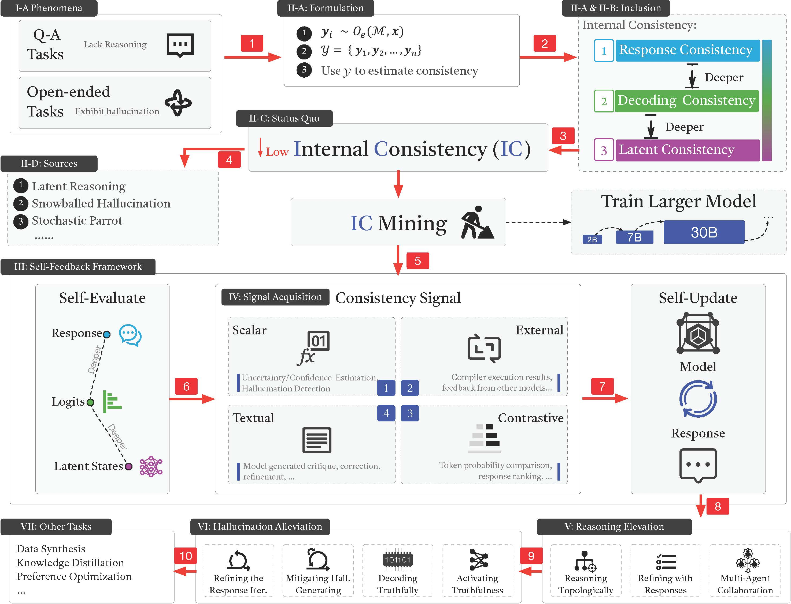

<h2>Internal Consistency and Self-Feedback in Large Language Models: A Survey</h2>

    <!-- arxiv badges -->
    
    <!-- Github -->
    
    <!-- HuggingFace -->
    
    <!-- Yuque -->
    

    

        <a href="https://scholar.google.com/citations?user=d0E7YlcAAAAJ">Xun Liang</a>1*, 
        <a href="https://ki-seki.github.io/">Shichao Song</a>1*, 
        <a href="https://github.com/fan2goa1">Zifan Zheng</a>2*,  
        <a href="https://github.com/MarrytheToilet">Hanyu Wang</a>1, 
        <a href="https://github.com/Duguce">Qingchen Yu</a>2, 
        <a href="https://xkli-allen.github.io/">Xunkai Li</a>3, 
        <a href="https://ronghuali.github.io/index.html">Rong-Hua Li</a>3, 
        <a href="https://scholar.google.com/citations?user=GOKgLdQAAAAJ">Feiyu Xiong</a>2, 
        <a href="https://www.semanticscholar.org/author/Zhiyu-Li/2268429641">Zhiyu Li</a>2†
    

    

        1<a href="https://en.ruc.edu.cn/">Renmin University of China</a>  
        2<a href="https://www.iaar.ac.cn/">Institute for Advanced Algorithms Research, Shanghai</a>  
        3<a href="https://english.bit.edu.cn/">Beijing Institute of Technology</a>
    

<small>*Equal contribution.</small>

<small>†Corresponding author: Zhiyu Li (<a href="mailto:lizy@iaar.ac.cn">lizy@iaar.ac.cn</a>).</small>

## 📰 News

- **2024/08/24** We have created a more user-friendly paper list: [Paper List](#paper-list)
- **2024/07/21** Our paper is published on the arXiv platform: [arXiv: 2407.14507](https://arxiv.org/abs/2407.14507).

## 🎉 Introduction

Welcome to the GitHub repository for our survey paper titled *"Internal Consistency and Self-Feedback in Large Language Models: A Survey."* This repository contains all the [resources](./data/), [code](./code/), and [references](#paper-list) associated with the paper. Our goal of the survey is to provide a unified perspective on the self-evaluation and self-updating mechanisms in LLMs, encapsulated within the frameworks of Internal Consistency and Self-Feedback. 

## 📚 Paper List

We provide a spreadsheet containing all the papers we reviewed: [Literature](https://www.yuque.com/zhiyu-n2wnm/ugzwgf/gmqfkfigd6xw26eg). A more readable table format is working in progress.

## 📆 To-Do List

- [ ] Create the Page.
- [ ] Improve paper list.
