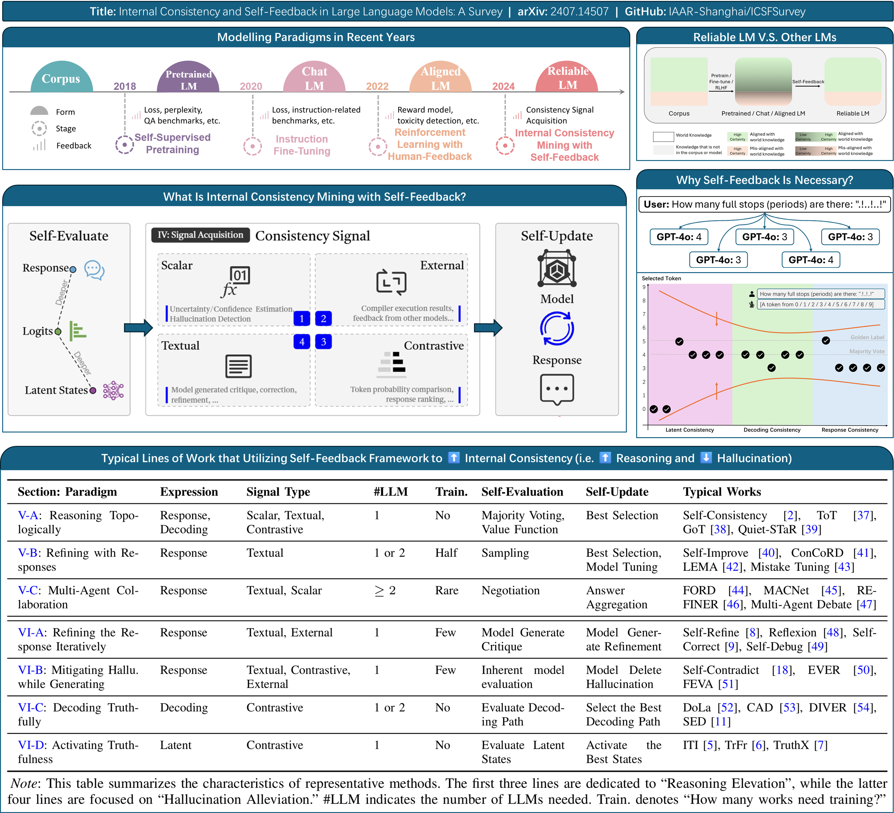

<h2 align="center">Internal Consistency and Self-Feedback in Large Language Models: A Survey</h2>

<p align="center">
  <i>
    Explore concepts like Self-Correct, Self-Refine, Self-Improve, Self-Contradict, Self-Play, and Self-Knowledge, alongside o1-like reasoning elevation🍓 and hallucination alleviation🍄.
  </i>
<p>

<p align="center">
    <!-- arxiv badges -->
    <a href="https://arxiv.org/abs/2407.14507">
        
    </a>
    <!-- Github -->
    <a href="https://github.com/IAAR-Shanghai/ICSFSurvey">
        
    </a>
    <!-- HuggingFace -->
    <a href="https://huggingface.co/papers/2407.14507">
        
    </a>
</p>

<p align="center">
  <a href="https://scholar.google.com/citations?user=d0E7YlcAAAAJ">Xun Liang</a><sup>1*</sup>, 
  <a href="https://ki-seki.github.io/">Shichao Song</a><sup>1*</sup>, 
  <a href="https://github.com/fan2goa1">Zifan Zheng</a><sup>2*</sup>, 
  <a href="https://github.com/MarrytheToilet">Hanyu Wang</a><sup>1</sup>, 
  <a href="https://github.com/Duguce">Qingchen Yu</a><sup>2</sup>, 
  <a href="https://xkli-allen.github.io/">Xunkai Li</a><sup>3</sup>, 
  <a href="https://ronghuali.github.io/index.html">Rong-Hua Li</a><sup>3</sup>, 
  Yi Wang<sup>4</sup>, 
  Zhonghao Wang<sup>4</sup>, 
  <a href="https://scholar.google.com/citations?user=GOKgLdQAAAAJ">Feiyu Xiong</a><sup>2</sup>, 
  <a href="https://www.semanticscholar.org/author/Zhiyu-Li/2268429641">Zhiyu Li</a><sup>2†</sup>
</p>

<p align="center">
  <small>
    <sup>1</sup><a href="https://en.ruc.edu.cn/">RUC</a>,
    <sup>2</sup><a href="https://www.iaar.ac.cn/">IAAR</a>,
    <sup>3</sup><a href="https://english.bit.edu.cn/">BIT</a>,
    <sup>4</sup><a href="https://english.news.cn/">Xinhua</a>
    <br>
    <sup>*</sup>Equal contribution, 
    <sup>†</sup>Corresponding author (lizy@iaar.ac.cn)
  </small>
</p>

> [!IMPORTANT]
> - Consider giving our repository a 🌟, so you will receive the latest news (paper list updates, new comments, etc.);  
> - If you want to cite our work, here is our bibtex entry: [CITATION.bib](./CITATION.bib).

## 📰 News

- **2024/10/26** We have created a relevant [WeChat Group (微信群)](https://github.com/IAAR-Shanghai/ICSFSurvey/releases/tag/v3.2) for discussing reasoning and hallucination in LLMs.
- **2024/09/18** [Paper v3.0](https://arxiv.org/abs/2407.14507) and a relevant [Twitter thread](https://x.com/Ki_Seki_here/status/1836020241538908529).
- **2024/08/24** Updated paper list for better user experience. [Link](#-paper-list). Ongoing updates.
- **2024/07/22** Our paper ranks first on Hugging Face Daily Papers! [Link](https://huggingface.co/papers?date=2024-07-22).
- **2024/07/21** Our paper is now available on arXiv. [Link](https://arxiv.org/abs/2407.14507).

## 🎉 Introduction

Welcome to the GitHub repository for our survey paper titled *"Internal Consistency and Self-Feedback in Large Language Models: A Survey."* The survey's goal is to provide a unified perspective on the self-evaluation and self-updating mechanisms in LLMs, encapsulated within the frameworks of Internal Consistency and Self-Feedback. 



This repository includes three key resources:
- [expt-consistency-types](./expt-consistency-types/): Code and results for measuring consistency at different levels.
- [expt-gpt4o-responses](./expt-gpt4o-responses/): Results from five different GPT-4o responses to the same query.
- [Paper List](./README.md#-paper-list): A comprehensive list of references related to our survey.

<details><summary>Click Me to Show the Table of Contents</summary>

- [📰 News](#-news)
- [🎉 Introduction](#-introduction)
- [📚 Paper List](#-paper-list)
  - [Related Survey Papers](#related-survey-papers)
  - [Section IV: Consistency Signal Acquisition](#section-iv-consistency-signal-acquisition)
    - [Confidence Estimation](#confidence-estimation)
    - [Hallucination Detection](#hallucination-detection)
    - [Uncertainty Estimation](#uncertainty-estimation)
    - [Verbal Critiquing](#verbal-critiquing)
    - [Faithfulness Measurement](#faithfulness-measurement)
    - [Consistency Estimation](#consistency-estimation)
  - [Section V: Reasoning Elevation](#section-v-reasoning-elevation)
    - [Reasoning Topologically](#reasoning-topologically)
    - [Refining with Responses](#refining-with-responses)
    - [Multi-Agent Collaboration](#multi-agent-collaboration)
  - [Section VI: Hallucination Alleviation](#section-vi-hallucination-alleviation)
    - [Mitigating Hallucination while Generating](#mitigating-hallucination-while-generating)
    - [Refining the Response Iteratively](#refining-the-response-iteratively)
    - [Activating Truthfulness](#activating-truthfulness)
    - [Decoding Truthfully](#decoding-truthfully)
  - [Section VII: Other Tasks](#section-vii-other-tasks)
    - [Preference Learning](#preference-learning)
    - [Knowledge Distillation](#knowledge-distillation)
    - [Continuous Learning](#continuous-learning)
    - [Data Synthesis](#data-synthesis)
    - [Consistency Optimization](#consistency-optimization)
    - [Decision Making](#decision-making)
    - [Event Argument Extraction](#event-argument-extraction)
    - [Inference Acceleration](#inference-acceleration)
    - [Machine Translation](#machine-translation)
    - [Negotiation Optimization](#negotiation-optimization)
    - [Retrieval Augmented Generation](#retrieval-augmented-generation)
    - [Text Classification](#text-classification)
    - [Self-Repair](#self-repair)
  - [Section VIII.A: Meta Evaluation](#section-viiia-meta-evaluation)
    - [Consistency Evaluation](#consistency-evaluation)
    - [Self-Knowledge Evaluation](#self-knowledge-evaluation)
    - [Uncertainty Evaluation](#uncertainty-evaluation)
    - [Feedback Ability Evaluation](#feedback-ability-evaluation)
    - [Reflection Ability Evaluation](#reflection-ability-evaluation)
  - [Theoretical Perspectives](#theoretical-perspectives)
- [📝 Citation](#-citation)

</details>

## 📚 Paper List

Here we list the most important references cited in our survey, as well as the papers we consider worth noting. **This list will be updated regularly.**

### Related Survey Papers

These are some of the most relevant surveys related to our paper.

- **A Survey on the Honesty of Large Language Models**  
  CUHK, arXiv, 2024
  [[Paper](https://arxiv.org/pdf/2409.18786)]
  [[Code](https://github.com/SihengLi99/LLM-Honesty-Survey)]

- **Awesome LLM Reasoning**  
  NTU, GitHub, 2024
  [[Code](https://github.com/atfortes/Awesome-LLM-Reasoning)]

- **Awesome LLM Strawberry**  
  NVIDIA, GitHub, 2024
  [[Code](https://github.com/hijkzzz/Awesome-LLM-Strawberry)]

- **Extrinsic Hallucinations in LLMs**  
  OpenAI, Blog, 2024
  [[Paper](https://lilianweng.github.io/posts/2024-07-07-hallucination/#sampling-based-detection)]

- **When Can LLMs Actually Correct Their Own Mistakes? A Critical Survey of Self-Correction of LLMs**  
  PSU, arXiv, 2024
  [[Paper](https://arxiv.org/abs/2406.01297)]

- **A Survey on Self-Evolution of Large Language Models**  
  PKU, arXiv, 2024
  [[Paper](https://arxiv.org/abs/2404.14387)]
  [[Code](https://github.com/AlibabaResearch/DAMO-ConvAI/tree/main/Awesome-Self-Evolution-of-LLM)]

- **Demystifying Chains, Trees, and Graphs of Thoughts**  
  ETH, arXiv, 2024
  [[Paper](https://arxiv.org/abs/2401.14295)]

- **Automatically Correcting Large Language Models: Surveying the Landscape of Diverse Automated Correction Strategies**  
  UCSB, TACL, 2024
  [[Paper](https://aclanthology.org/2024.tacl-1.27/)]
  [[Code](https://github.com/teacherpeterpan/self-correction-llm-papers)]

- **Uncertainty in Natural Language Processing: Sources, Quantification, and Applications**  
  Nankai, arXiv, 2023
  [[Paper](https://arxiv.org/abs/2306.04459)]

### Section IV: Consistency Signal Acquisition

For various forms of expressions from an LLM, we can obtain various forms of consistency signals, which can help in better updating the expressions.

#### Confidence Estimation

- **Can LLMs Express Their Uncertainty? An Empirical Evaluation of Confidence Elicitation in LLMs**  
  NUS, ICLR, 2024
  [[Paper](https://openreview.net/forum?id=gjeQKFxFpZ)]
  [[Code](https://github.com/MiaoXiong2320/llm-uncertainty)]

- **Linguistic Calibration of Long-Form Generations**  
  Stanford, ICML, 2024
  [[Paper](https://icml.cc/virtual/2024/poster/32959)]
  [[Code](https://github.com/tatsu-lab/linguistic_calibration)]

- **InternalInspector I2: Robust Confidence Estimation in LLMs through Internal States**  
  VT, arXiv, 2024
  [[Paper](https://arxiv.org/abs/2406.12053)]

- **Cycles of Thought: Measuring LLM Confidence through Stable Explanations**  
  UCLA, arXiv, 2024
  [[Paper](https://arxiv.org/abs/2406.03441)]

- **TrustScore: Reference-Free Evaluation of LLM Response Trustworthiness**  
  UoEdin, arXiv, 2024
  [[Paper](https://arxiv.org/abs/2402.12545)]
  [[Code](https://github.com/dannalily/TrustScore)]

- **Semantic Uncertainty: Linguistic Invariances for Uncertainty Estimation in Natural Language Generation**  
  Oxford, ICLR, 2023
  [[Paper](https://openreview.net/forum?id=VD-AYtP0dve)]
  [[Code](https://github.com/lorenzkuhn/semantic_uncertainty)]

- **Quantifying Uncertainty in Answers from any Language Model and Enhancing their Trustworthiness**  
  UMD, arXiv, 2023
  [[Paper](https://arxiv.org/abs/2308.16175)]

- **Teaching models to express their uncertainty in words**  
  Oxford, TMLR, 2022
  [[Paper](https://openreview.net/forum?id=8s8K2UZGTZ)]
  [[Code](https://github.com/sylinrl/CalibratedMath)]

- **Language Models (Mostly) Know What They Know**  
  Anthropic, arXiv, 2022
  [[Paper](https://arxiv.org/abs/2207.05221)]

#### Hallucination Detection

- **Prompt-Guided Internal States for Hallucination Detection of Large Language Models**  
  Nankai, arXiv, 2024
  [[Paper](https://arxiv.org/abs/2411.04847)]
  [[Code](https://github.com/fujie-math/PRISM)]

- **Detecting hallucinations in large language models using semantic entropy**  
  Oxford, Nature, 2024
  [[Paper](https://www.nature.com/articles/s41586-024-07421-0)]

- **INSIDE: LLMs' Internal States Retain the Power of Hallucination Detection**  
  Alibaba, ICLR, 2024
  [[Paper](https://openreview.net/forum?id=Zj12nzlQbz)]

- **LLM Internal States Reveal Hallucination Risk Faced With a Query**  
  HKUST, arXiv, 2024
  [[Paper](https://arxiv.org/abs/2407.03282)]

- **Teaching Large Language Models to Express Knowledge Boundary from Their Own Signals**  
  Fudan, arXiv, 2024
  [[Paper](https://arxiv.org/abs/2406.10881)]

- **Knowing What LLMs DO NOT Know: A Simple Yet Effective Self-Detection Method**  
  SDU, NAACL, 2024
  [[Paper](https://arxiv.org/abs/2310.17918)]
  [[Code](https://github.com/yukunZhao/Self-DETECTION)]

- **LM vs LM: Detecting Factual Errors via Cross Examination**  
  TAU, EMNLP, 2023
  [[Paper](https://aclanthology.org/2023.emnlp-main.778/)]

- **SelfCheckGPT: Zero-Resource Black-Box Hallucination Detection for Generative Large Language Models**  
  Cambridge, EMNLP, 2023
  [[Paper](https://aclanthology.org/2023.emnlp-main.557/)]
  [[Code](https://github.com/potsawee/selfcheckgpt)]

#### Uncertainty Estimation

- **Semantic Density: Uncertainty Quantification for Large Language Models through Confidence Measurement in Semantic Space**  
  Cognizant, NeuIPS, 2024
  [[Paper](https://arxiv.org/abs/2405.13845)]
  [[Code](https://github.com/cognizant-ai-labs/semantic-density-paper)]

- **Generating with Confidence: Uncertainty Quantification for Black-box Large Language Models**  
  UIUC, TMLR, 2024
  [[Paper](https://openreview.net/forum?id=DWkJCSxKU5)]
  [[Code](https://github.com/zlin7/UQ-NLG)]

- **Uncertainty Estimation of Large Language Models in Medical Question Answering**  
  HKU, arXiv, 2024
  [[Paper](https://arxiv.org/abs/2407.08662)]

- **To Believe or Not to Believe Your LLM**  
  Google, arXiv, 2024
  [[Paper](https://arxiv.org/abs/2406.02543)]

- **Shifting Attention to Relevance: Towards the Uncertainty Estimation of Large Language Models**  
  DU, ACL, 2024
  [[Paper](https://arxiv.org/abs/2307.01379)]
  [[Code](https://github.com/jinhaoduan/SAR)]

- **Active Prompting with Chain-of-Thought for Large Language Models**  
  HUST, arXiv, 2023
  [[Paper](https://arxiv.org/abs/2302.12246)]
  [[Code](https://github.com/shizhediao/active-prompt)]

- **Uncertainty Estimation in Autoregressive Structured Prediction**  
  Yandex, ICLR, 2021
  [[Paper](https://openreview.net/forum?id=jN5y-zb5Q7m)]

- **On Hallucination and Predictive Uncertainty in Conditional Language Generation**  
  UCSB, EACL, 2021
  [[Paper](https://aclanthology.org/2021.eacl-main.236/)]

#### Verbal Critiquing

- **LLM Critics Help Catch LLM Bugs**  
  OpenAI, arXiv, 2024
  [[Paper](https://arxiv.org/abs/2407.00215)]

- **Reasons to Reject? Aligning Language Models with Judgments**  
  Tencent, ACL, 2024
  [[Paper](https://arxiv.org/abs/2312.14591)]
  [[Code](https://github.com/wwxu21/CUT)]

- **Self-critiquing models for assisting human evaluators**  
  OpenAI, arXiv, 2022
  [[Paper](https://arxiv.org/abs/2206.05802)]

#### Faithfulness Measurement

- **Are self-explanations from Large Language Models faithful?**  
  Mila, ACL, 2024
  [[Paper](https://arxiv.org/abs/2401.07927)]

- **On Measuring Faithfulness or Self-consistency of Natural Language Explanations**  
  UAH, ACL, 2024
  [[Paper](https://arxiv.org/abs/2311.07466)]
  [[Code](https://github.com/Heidelberg-NLP/CC-SHAP)]

#### Consistency Estimation

- **Semantic Consistency for Assuring Reliability of Large Language Models**  
  DTU, arXiv, 2023
  [[Paper](https://arxiv.org/abs/2308.09138)]

### Section V: Reasoning Elevation

Enhancing reasoning ability by improving LLM performance on QA tasks through Self-Feedback strategies.

#### Reasoning Topologically

- **Dynamic Self-Consistency: Leveraging Reasoning Paths for Efficient LLM Sampling**  
  Virginia, arXiv, 2024
  [[Paper](https://arxiv.org/abs/2408.17017)]

- **Decoding on Graphs: Faithful and Sound Reasoning on Knowledge Graphs through Generation of Well-Formed Chains**  
  CUHK, arXiv, 2024
  [[Paper](https://arxiv.org/abs/2410.18415)]

- **DSPy: Compiling Declarative Language Model Calls into State-of-the-Art Pipelines**  
  Stanford, ICLR, 2024
  [[Paper](https://openreview.net/forum?id=sY5N0zY5Od)]
  [[Code](https://github.com/stanfordnlp/dspy)]

- **Graph of Thoughts: Solving Elaborate Problems with Large Language Models**  
  ETH, AAAI, 2024
  [[Paper](https://ojs.aaai.org/index.php/AAAI/article/view/29720)]
  [[Code](https://github.com/spcl/graph-of-thoughts)]

- **Integrate the Essence and Eliminate the Dross: Fine-Grained Self-Consistency for Free-Form Language Generation**  
  BIT, ACL, 2024
  [[Paper](https://arxiv.org/abs/2407.02056)]
  [[Code](https://github.com/WangXinglin/FSC)]

- **Buffer of Thoughts: Thought-Augmented Reasoning with Large Language Models**  
  PKU, arXiv, 2024
  [[Paper](https://arxiv.org/abs/2406.04271)]
  [[Code](https://github.com/YangLing0818/buffer-of-thought-llm)]

- **RATT: A Thought Structure for Coherent and Correct LLM Reasoning**  
  PSU, arXiv, 2024
  [[Paper](https://arxiv.org/abs/2406.02746)]
  [[Code](https://github.com/jinghanzhang1998/RATT)]

- **Quiet-STaR: Language Models Can Teach Themselves to Think Before Speaking**  
  Stanford, arXiv, 2024
  [[Paper](https://arxiv.org/abs/2403.09629)]
  [[Code](https://github.com/ezelikman/quiet-star)]

- **Chain-of-Thought Reasoning Without Prompting**  
  Google, arXiv, 2024
  [[Paper](https://arxiv.org/abs/2402.10200)]

- **Self-Contrast: Better Reflection Through Inconsistent Solving Perspectives**  
  ZJU, ACL, 2024
  [[Paper](https://arxiv.org/abs/2401.02009)]

- **Training Language Models to Self-Correct via Reinforcement Learning**  
  Google, arXiv, 2024
  [[Paper](https://arxiv.org/abs/2409.12917)]

- **LLMs cannot find reasoning errors, but can correct them given the error location**  
  Cambridge, ACL, 2024
  [[Paper](https://arxiv.org/abs/2311.08516)]

- **Forward-Backward Reasoning in Large Language Models for Mathematical Verification**  
  SUSTech, ACL, 2024
  [[Paper](https://arxiv.org/abs/2308.07758)]
  [[Code](https://github.com/ws-jiang/fobar-public)]

- **LeanReasoner: Boosting Complex Logical Reasoning with Lean**  
  JHU, NAACL, 2024
  [[Paper](https://aclanthology.org/2024.naacl-long.416/)]
  [[Code](https://github.com/Some-random/theorem-proving-reasoning)]

- **Just Ask One More Time! Self-Agreement Improves Reasoning of Language Models in (Almost) All Scenarios**  
  Kuaishou, ACL, 2024
  [[Paper](https://aclanthology.org/2024.findings-acl.230/)]

- **Soft Self-Consistency Improves Language Model Agents**  
  UNC-CH, ACL, 2024
  [[Paper](https://aclanthology.org/2024.acl-short.28/)]
  [[Code](https://github.com/HanNight/soft_self_consistency)]

- **Self-Evaluation Guided Beam Search for Reasoning**  
  NUS, NeuIPS, 2023
  [[Paper](https://openreview.net/forum?id=Bw82hwg5Q3)]
  [[Code](https://github.com/YuxiXie/SelfEval-Guided-Decoding)]

- **Tree of Thoughts: Deliberate Problem Solving with Large Language Models**  
  Princeton, NeuIPS, 2023
  [[Paper](https://openreview.net/forum?id=5Xc1ecxO1h)]
  [[Code](https://github.com/princeton-nlp/tree-of-thought-llm)]

- **Self-Consistency Improves Chain of Thought Reasoning in Language Models**  
  Google, ICLR, 2023
  [[Paper](https://openreview.net/forum?id=1PL1NIMMrw)]

- **DSPy Assertions: Computational Constraints for Self-Refining Language Model Pipelines**  
  Stanford, arXiv, 2023
  [[Paper](https://arxiv.org/abs/2312.13382)]
  [[Code](https://github.com/stanfordnlp/dspy)]

- **Universal Self-Consistency for Large Language Model Generation**  
  Google, arXiv, 2023
  [[Paper](https://arxiv.org/abs/2311.17311)]

- **Enhancing Large Language Models in Coding Through Multi-Perspective Self-Consistency**  
  PKU, ACL, 2023
  [[Paper](https://arxiv.org/abs/2309.17272)]
  [[Code](https://github.com/skpig/MPSC)]

- **Promptbreeder: Self-Referential Self-Improvement Via Prompt Evolution**  
  Google, arXiv, 2023
  [[Paper](https://arxiv.org/abs/2309.16797)]

- **Demonstrate-Search-Predict: Composing retrieval and language models for knowledge-intensive NLP**  
  Stanford, arXiv, 2023
  [[Paper](https://arxiv.org/abs/2212.14024)]
  [[Code](https://github.com/stanfordnlp/dspy)]

- **Making Language Models Better Reasoners with Step-Aware Verifier**  
  PKU, ACL, 2023
  [[Paper](https://aclanthology.org/2023.acl-long.291/)]
  [[Code](https://github.com/microsoft/DiVeRSe)]

- **Chain-of-Thought Prompting Elicits Reasoning in Large Language Models**  
  Google, NeuIPS, 2022
  [[Paper](https://openreview.net/forum?id=_VjQlMeSB_J)]

- **Maieutic Prompting: Logically Consistent Reasoning with Recursive Explanations**  
  Washington, EMNLP, 2022
  [[Paper](https://aclanthology.org/2022.emnlp-main.82/)]
  [[Code](https://github.com/jaehunjung1/Maieutic-Prompting)]

#### Refining with Responses

- **SaySelf: Teaching LLMs to Express Confidence with Self-Reflective Rationales**  
  Purdue, EMNLP, 2024
  [[Paper](https://arxiv.org/abs/2405.20974)]
  [[Code](https://github.com/xu1868/SaySelf)]

- **Small Language Models Need Strong Verifiers to Self-Correct Reasoning**  
  UMich, ACL, 2024
  [[Paper](https://arxiv.org/pdf/2404.17140)]
  [[Code](https://github.com/yunx-z/SCORE)]

- **Fine-Tuning with Divergent Chains of Thought Boosts Reasoning Through Self-Correction in Language Models**  
  TUDa, arXiv, 2024
  [[Paper](https://arxiv.org/abs/2407.03181)]
  [[Code](https://github.com/UKPLab/arxiv2024-divergent-cot)]

- **Accessing GPT-4 level Mathematical Olympiad Solutions via Monte Carlo Tree Self-refine with LLaMa-3 8B**  
  Fudan, arXiv, 2024
  [[Paper](https://arxiv.org/abs/2406.07394)]
  [[Code](https://github.com/trotsky1997/MathBlackBox)]

- **Teaching Language Models to Self-Improve by Learning from Language Feedback**  
  NEU, ACL, 2024
  [[Paper](https://arxiv.org/abs/2406.07168)]

- **Large Language Models Can Self-Improve At Web Agent Tasks**  
  UPenn, arXiv, 2024
  [[Paper](https://arxiv.org/abs/2405.20309)]

- **Toward Self-Improvement of LLMs via Imagination, Searching, and Criticizing**  
  Tencent, arXiv, 2024
  [[Paper](https://arxiv.org/abs/2404.12253)]

- **Can LLMs Learn from Previous Mistakes? Investigating LLMs’ Errors to Boost for Reasoning**  
  UCSD, ACL, 2024
  [[Paper](https://arxiv.org/abs/2403.20046)]
  [[Code](https://github.com/YookiTong/Learn-from-Mistakes-CotErrorSet)]

- **Fine-Grained Self-Endorsement Improves Factuality and Reasoning**  
  XMU, ACL, 2024
  [[Paper](https://arxiv.org/abs/2402.15631)]

- **Mirror: A Multiple-perspective Self-Reflection Method for Knowledge-rich Reasoning**  
  KCL, ACL, 2024
  [[Paper](https://arxiv.org/abs/2402.14963)]
  [[Code](https://github.com/hanqi-qi/Mirror)]

- **Self-Alignment for Factuality: Mitigating Hallucinations in LLMs via Self-Evaluation**  
  CUHK, ACL, 2024
  [[Paper](https://arxiv.org/abs/2402.09267)]
  [[Code](https://github.com/zhangxy-2019/Self-Alignment-for-Factuality)]

- **Self-Rewarding Language Models**  
  Meta, arXiv, 2024
  [[Paper](https://arxiv.org/abs/2401.10020)]

- **Learning From Mistakes Makes LLM Better Reasoner**  
  Microsoft, arXiv, 2024
  [[Paper](https://arxiv.org/abs/2310.20689)]
  [[Code](https://github.com/microsoft/LEMA)]

- **Principle-Driven Self-Alignment of Language Models from Scratch with Minimal Human Supervision**  
  CMU, NeuIPS, 2023
  [[Paper](https://proceedings.neurips.cc/paper_files/paper/2023/hash/0764db1151b936aca59249e2c1386101-Abstract-Conference.html)]
  [[Code](https://github.com/IBM/Dromedary)]

- **Large Language Models Can Self-Improve**  
  Illinois, EMNLP, 2023
  [[Paper](https://aclanthology.org/2023.emnlp-main.67/)]

- **Improving Logical Consistency in Pre-Trained Language Models using Natural Language Inference**  
  Stanford, Stanford CS224N Custom Project, 2022
  [[Paper](https://web.stanford.edu/class/archive/cs/cs224n/cs224n.1224/reports/custom_116994635.pdf)]

- **Enhancing Self-Consistency and Performance of Pre-Trained Language Models through Natural Language Inference**  
  Stanford, EMNLP, 2022
  [[Paper](https://aclanthology.org/2022.emnlp-main.115/)]
  [[Code](https://github.com/eric-mitchell/concord)]

#### Multi-Agent Collaboration

- **The Consensus Game: Language Model Generation via Equilibrium Search**  
  MIT, ICLR, 2024
  [[Paper](https://openreview.net/forum?id=n9xeGcI4Yg)]

- **Improving Factuality and Reasoning in Language Models through Multiagent Debate**  
  MIT, ICML, 2024
  [[Paper](https://icml.cc/virtual/2024/poster/32620)]
  [[Code](https://github.com/composable-models/llm_multiagent_debate)]

- **Scaling Large-Language-Model-based Multi-Agent Collaboration**  
  THU, arXiv, 2024
  [[Paper](https://arxiv.org/abs/2406.07155)]
  [[Code](https://github.com/OpenBMB/ChatDev)]

- **AutoAct: Automatic Agent Learning from Scratch for QA via Self-Planning**  
  ZJU, ACL, 2024
  [[Paper](https://arxiv.org/abs/2401.05268)]
  [[Code](https://github.com/zjunlp/AutoAct)]

- **ReConcile: Round-Table Conference Improves Reasoning via Consensus among Diverse LLMs**  
  UNC, ACL, 2024
  [[Paper](https://arxiv.org/abs/2309.13007)]
  [[Code](https://github.com/dinobby/ReConcile)]

- **REFINER: Reasoning Feedback on Intermediate Representations**  
  EPFL, EACL, 2024
  [[Paper](https://aclanthology.org/2024.eacl-long.67/)]
  [[Code](https://github.com/debjitpaul/refiner)]

- **Examining Inter-Consistency of Large Language Models Collaboration: An In-depth Analysis via Debate**  
  HIT, EMNLP, 2023
  [[Paper](https://aclanthology.org/2023.findings-emnlp.508/)]
  [[Code](https://github.com/Waste-Wood/FORD)]

### Section VI: Hallucination Alleviation

Improving factual accuracy in open-ended generation and reducing hallucinations through Self-Feedback strategies.

#### Mitigating Hallucination while Generating

- **Self-contradictory Hallucinations of Large Language Models: Evaluation, Detection and Mitigation**  
  ETH, ICLR, 2024
  [[Paper](https://openreview.net/forum?id=EmQSOi1X2f)]
  [[Code](https://github.com/eth-sri/ChatProtect)]

- **Mitigating Entity-Level Hallucination in Large Language Models**  
  THU, arXiv, 2024
  [[Paper](https://arxiv.org/abs/2407.09417)]
  [[Code](https://github.com/oneal2000/EntityHallucination)]

- **Know the Unknown: An Uncertainty-Sensitive Method for LLM Instruction Tuning**  
  HKUST, arXiv, 2024
  [[Paper](https://arxiv.org/abs/2406.10099)]
  [[Code](https://github.com/JiaqiLi404/TrustworthyRAG)]

- **Fine-grained Hallucination Detection and Editing for Language Models**  
  UoW, arXiv, 2024
  [[Paper](https://arxiv.org/abs/2401.06855)]
  [[Code](https://github.com/abhika-m/FAVA)]

- **EVER: Mitigating Hallucination in Large Language Models through Real-Time Verification and Rectification**  
  UNC, arXiv, 2023
  [[Paper](https://arxiv.org/abs/2311.09114)]

- **Chain-of-Verification Reduces Hallucination in Large Language Models**  
  Meta, arXiv, 2023
  [[Paper](https://arxiv.org/abs/2309.11495)]

- **PURR: Efficiently Editing Language Model Hallucinations by Denoising Language Model Corruptions**  
  UCI, arXiv, 2023
  [[Paper](https://arxiv.org/abs/2305.14908)]

- **RARR: Researching and Revising What Language Models Say, Using Language Models**  
  CMU, ACL, 2023
  [[Paper](https://aclanthology.org/2023.acl-long.910/)]
  [[Code](https://github.com/anthonywchen/RARR)]

#### Refining the Response Iteratively

- **From Code to Correctness: Closing the Last Mile of Code Generation with Hierarchical Debugging**  
  SJTU, arXiv, 2024
  [[Paper](https://arxiv.org/pdf/2410.01215)]
  [[Code](https://github.com/YerbaPage/MGDebugger)]

- **Teaching Large Language Models to Self-Debug**  
  Google, ICLR, 2024
  [[Paper](https://openreview.net/forum?id=KuPixIqPiq)]

- **LLMs can learn self-restraint through iterative self-reflection**  
  ServiceNow, arXiv, 2024
  [[Paper](https://arxiv.org/abs/2405.13022)]

- **Reflexion: Language Agents with Verbal Reinforcement Learning**  
  Northeastern, NeuIPS, 2023
  [[Paper](https://proceedings.neurips.cc/paper_files/paper/2023/hash/1b44b878bb782e6954cd888628510e90-Abstract-Conference.html)]
  [[Code](https://github.com/noahshinn/reflexion)]

- **Generating Sequences by Learning to Self-Correct**  
  AI2, ICLR, 2023
  [[Paper](https://openreview.net/forum?id=hH36JeQZDaO)]

- **MAF: Multi-Aspect Feedback for Improving Reasoning in Large Language Models**  
  UCSB, EMNLP, 2023
  [[Paper](https://openreview.net/forum?id=bNeDLx5O6w)]
  [[Code](https://github.com/deepakn97/MAF)]

- **Self-Refine: Iterative Refinement with Self-Feedback**  
  CMU, NeuIPS, 2023
  [[Paper](https://openreview.net/forum?id=S37hOerQLB)]
  [[Code](https://github.com/madaan/self-refine)]

- **PEER: A Collaborative Language Model**  
  Meta, ICLR, 2023
  [[Paper](https://openreview.net/forum?id=KbYevcLjnc)]

- **Re3: Generating Longer Stories With Recursive Reprompting and Revision**  
  Berkeley, EMNLP, 2023
  [[Paper](https://aclanthology.org/2022.emnlp-main.296/)]
  [[Code](https://github.com/yangkevin2/emnlp22-re3-story-generation)]

#### Activating Truthfulness

- **Truth Forest: Toward Multi-Scale Truthfulness in Large Language Models through Intervention without Tuning**  
  BUAA, AAAI, 2024
  [[Paper](https://ojs.aaai.org/index.php/AAAI/article/view/30087)]
  [[Code](https://github.com/jongjyh/TrFr)]

- **Look Within, Why LLMs Hallucinate: A Causal Perspective**  
  NUDT, arXiv, 2024
  [[Paper](https://arxiv.org/abs/2407.10153)]

- **Retrieval Head Mechanistically Explains Long-Context Factuality**  
  PKU, arXiv, 2024
  [[Paper](https://arxiv.org/abs/2404.15574)]
  [[Code](https://github.com/nightdessert/Retrieval_Head)]

- **TruthX: Alleviating Hallucinations by Editing Large Language Models in Truthful Space**  
  ICT, ACL, 2024
  [[Paper](https://arxiv.org/abs/2402.17811)]
  [[Code](https://github.com/ictnlp/TruthX)]

- **Inference-Time Intervention: Eliciting Truthful Answers from a Language Model**  
  Harvard, NeuIPS, 2023
  [[Paper](https://openreview.net/forum?id=aLLuYpn83y)]
  [[Code](https://github.com/likenneth/honest_llama)]

- **Fine-tuning Language Models for Factuality**  
  Stanford, arXiv, 2023
  [[Paper](https://arxiv.org/abs/2311.08401)]

#### Decoding Truthfully

- **Diver: Large Language Model Decoding with Span-Level Mutual Information Verification**  
  IA, arXiv, 2024
  [[Paper](https://arxiv.org/abs/2406.02120)]

- **SED: Self-Evaluation Decoding Enhances Large Language Models for Better Generation**  
  FDU, arXiv, 2024
  [[Paper](https://arxiv.org/abs/2405.16552)]

- **Enhancing Contextual Understanding in Large Language Models through Contrastive Decoding**  
  Edin, arXiv, 2024
  [[Paper](https://arxiv.org/abs/2405.02750)]
  [[Code](https://github.com/amazon-science/ContextualUnderstanding-ContrastiveDecoding)]

- **DoLa: Decoding by Contrasting Layers Improves Factuality in Large Language Models**  
  MIT, ICLR, 2024
  [[Paper](https://arxiv.org/abs/2309.03883)]
  [[Code](https://github.com/voidism/DoLa)]

- **Trusting Your Evidence: Hallucinate Less with Context-aware Decoding**  
  UoW, arXiv, 2023
  [[Paper](https://arxiv.org/abs/2305.14739)]

- **Contrastive Decoding: Open-ended Text Generation as Optimization**  
  Stanford, ACL, 2023
  [[Paper](https://aclanthology.org/2023.acl-long.687/)]
  [[Code](https://github.com/XiangLi1999/ContrastiveDecoding)]

### Section VII: Other Tasks

In addition to tasks aimed at improving consistency (enhancing reasoning and alleviating hallucinations), there are other tasks that also utilize Self-Feedback strategies.

#### Preference Learning

- **Language Imbalance Driven Rewarding for Multilingual Self-improving**  
  UCAS, arXiv, 2024
  [[Paper](https://arxiv.org/abs/2410.08964)]
  [[Code](https://github.com/ZNLP/Language-Imbalance-Driven-Rewarding)]

- **Aligning Large Language Models via Self-Steering Optimization**  
  ISCAS, arXiv, 2024
  [[Paper](https://arxiv.org/abs/2410.17131)]
  [[Code](https://github.com/icip-cas/SSO)]

- **Aligning Large Language Models from Self-Reference AI Feedback with one General Principle**  
  FDU, arXiv, 2024
  [[Paper](https://arxiv.org/abs/2406.11190)]
  [[Code](https://github.com/rbao2018/self_ref_feedback)]

- **Aligning Large Language Models with Self-generated Preference Data**  
  KAIST, arXiv, 2024
  [[Paper](https://arxiv.org/abs/2406.04412)]

- **Self-Alignment of Large Language Models via Monopolylogue-based Social Scene Simulation**  
  SJTU, PMLR, 2024
  [[Paper](https://proceedings.mlr.press/v235/pang24a.html)]
  [[Code](https://github.com/ShuoTang123/MATRIX)]

- **Self-Improving Robust Preference Optimization**  
  Cohere, arXiv, 2024
  [[Paper](https://arxiv.org/abs/2406.01660)]

- **Self-Play Fine-Tuning Converts Weak Language Models to Strong Language Models**  
  UCLA, PMLR, 2024
  [[Paper](https://proceedings.mlr.press/v235/chen24j.html)]
  [[Code](https://github.com/uclaml/SPIN)]

- **Self-Play Preference Optimization for Language Model Alignment**  
  UCLA, arXiv, 2024
  [[Paper](https://arxiv.org/abs/2405.00675)]
  [[Code](https://github.com/uclaml/SPPO)]

- **ChatGLM-Math: Improving Math Problem-Solving in Large Language Models with a Self-Critique Pipeline**  
  Zhipu, arXiv, 2024
  [[Paper](https://arxiv.org/abs/2404.02893)]
  [[Code](https://github.com/THUDM/ChatGLM-Math)]

- **SALMON: Self-Alignment with Instructable Reward Models**  
  IBM, ICLR, 2024
  [[Paper](https://arxiv.org/abs/2310.05910)]
  [[Code](https://github.com/IBM/SALMON)]

- **Self-Specialization: Uncovering Latent Expertise within Large Language Models**  
  GT, ACL, 2024
  [[Paper](https://aclanthology.org/2024.findings-acl.157/)]

- **BeaverTails: Towards Improved Safety Alignment of LLM via a Human-Preference Dataset**  
  PKU, NeurIPS, 2023
  [[Paper](https://openreview.net/forum?id=g0QovXbFw3&noteId=OleVjyinhk)]
  [[Code](https://sites.google.com/view/pku-beavertails)]

- **Safe RLHF: Safe Reinforcement Learning from Human Feedback**  
  PKU, arXiv, 2023
  [[Paper](https://arxiv.org/pdf/2310.12773)]
  [[Code](https://github.com/PKU-Alignment/safe-rlhf)]

- **Aligning Large Language Models through Synthetic Feedback**  
  NAVER, arXiv, 2023
  [[Paper](https://arxiv.org/abs/2305.13735)]
  [[Code](https://github.com/naver-ai/almost)]

- **OpenAssistant Conversations -- Democratizing Large Language Model Alignment**  
  Unaffiliated, arXiv, 2023
  [[Paper](https://arxiv.org/abs/2304.07327)]
  [[Code](https://github.com/LAION-AI/Open-Assistant)]

- **The Capacity for Moral Self-Correction in Large Language Models**  
  Anthropic, arXiv, 2023
  [[Paper](https://arxiv.org/abs/2302.07459)]

- **Constitutional AI: Harmlessness from AI Feedback**  
  Anthropic, arXiv, 2022
  [[Paper](https://arxiv.org/abs/2212.08073)]
  [[Code](https://github.com/anthropics/ConstitutionalHarmlessnessPaper)]

- **Training a Helpful and Harmless Assistant with Reinforcement Learning from Human Feedback**  
  Anthropic, arXiv, 2022
  [[Paper](https://arxiv.org/abs/2204.05862)]
  [[Code](https://github.com/anthropics/hh-rlhf)]

#### Knowledge Distillation

- **Beyond Imitation: Leveraging Fine-grained Quality Signals for Alignment**  
  RUC, ICLR, 2024
  [[Paper](https://openreview.net/forum?id=LNLjU5C5dK)]
  [[Code](https://github.com/RUCAIBox/FIGA)]

- **On-Policy Distillation of Language Models: Learning from Self-Generated Mistakes**  
  Google, ICLR, 2024
  [[Paper](https://openreview.net/forum?id=3zKtaqxLhW)]

- **Self-Refine Instruction-Tuning for Aligning Reasoning in Language Models**  
  Idiap, arXiv, 2024
  [[Paper](https://arxiv.org/abs/2405.00402)]

- **Personalized Distillation: Empowering Open-Sourced LLMs with Adaptive Learning for Code Generation**  
  NTU, EMNLP, 2023
  [[Paper](https://openreview.net/forum?id=alxWMBcNVN)]
  [[Code](https://github.com/SalesforceAIResearch/PersDistill)]

- **SelFee: Iterative Self-Revising LLM Empowered by Self-Feedback Generation**  
  KAIST, Blog, 2023
  [[Paper](https://lklab.kaist.ac.kr/SelFee/)]

- **Reinforced Self-Training (ReST) for Language Modeling**  
  Google, arXiv, 2023
  [[Paper](https://arxiv.org/abs/2308.08998)]

- **Impossible Distillation: from Low-Quality Model to High-Quality Dataset & Model for Summarization and Paraphrasing**  
  Washington, arXiv, 2023
  [[Paper](https://arxiv.org/abs/2305.16635)]

- **Self-Knowledge Distillation with Progressive Refinement of Targets**  
  LG, ICCV, 2021
  [[Paper](https://openaccess.thecvf.com/content/ICCV2021/html/Kim_Self-Knowledge_Distillation_With_Progressive_Refinement_of_Targets_ICCV_2021_paper.html)]
  [[Code](https://github.com/lgcnsai/PS-KD-Pytorch)]

- **Revisiting Knowledge Distillation via Label Smoothing Regularization**  
  NUS, CVPR, 2020
  [[Paper](https://openaccess.thecvf.com/content_CVPR_2020/html/Yuan_Revisiting_Knowledge_Distillation_via_Label_Smoothing_Regularization_CVPR_2020_paper.html)]

- **Self-Knowledge Distillation in Natural Language Processing**  
  Handong, RANLP, 2019
  [[Paper](https://aclanthology.org/R19-1050/)]

#### Continuous Learning

- **Self-Tuning: Instructing LLMs to Effectively Acquire New Knowledge through Self-Teaching**  
  CUHK, arXiv, 2024
  [[Paper](https://arxiv.org/abs/2406.06326)]

- **Self-Evolving GPT: A Lifelong Autonomous Experiential Learner**  
  HIT, ACL, 2024
  [[Paper](https://aclanthology.org/2024.acl-long.346/)]
  [[Code](https://github.com/ArrogantL/se_gpt)]

#### Data Synthesis

- **Self-Taught Evaluators**  
   Meta, arXiv, 2024
  [[Paper](https://arxiv.org/abs/2408.02666)]

- **Self-Instruct: Aligning Language Models with Self-Generated Instructions**  
  Washington, ACL, 2023
  [[Paper](https://aclanthology.org/2023.acl-long.754/)]
  [[Code](https://github.com/yizhongw/self-instruct)]

- **Self-training Improves Pre-training for Natural Language Understanding**  
  Facebook, arXiv, 2020
  [[Paper](https://arxiv.org/abs/2010.02194)]

#### Consistency Optimization

- **Improving the Robustness of Large Language Models via Consistency Alignment**  
  SDU, LREC-COLING, 2024
  [[Paper](https://aclanthology.org/2024.lrec-main.782/)]

#### Decision Making

- **Can Large Language Models Play Games? A Case Study of A Self-Play Approach**  
  Northwestern, arXiv, 2024
  [[Paper](https://arxiv.org/abs/2403.05632)]

#### Event Argument Extraction

- **ULTRA: Unleash LLMs' Potential for Event Argument Extraction through Hierarchical Modeling and Pair-wise Refinement**  
  UMich, ACL, 2024
  [[Paper](https://aclanthology.org/2024.findings-acl.487/)]

#### Inference Acceleration

- **Draft & Verify: Lossless Large Language Model Acceleration via Self-Speculative Decoding**  
  ZJU, ACL, 2024
  [[Paper](https://aclanthology.org/2024.acl-long.607/)]
  [[Code](https://github.com/dilab-zju/self-speculative-decoding)]

#### Machine Translation

- **TasTe: Teaching Large Language Models to Translate through Self-Reflection**  
  HIT, ACL, 2024
  [[Paper](https://aclanthology.org/2024.acl-long.333/)]
  [[Code](https://github.com/YutongWang1216/ReflectionLLMMT)]

#### Negotiation Optimization

- **Improving Language Model Negotiation with Self-Play and In-Context Learning from AI Feedback**  
  Edin, arXiv, 2023
  [[Paper](https://arxiv.org/abs/2305.10142)]
  [[Code](https://github.com/FranxYao/GPT-Bargaining)]

#### Retrieval Augmented Generation

- **Improving Retrieval Augmented Language Model with Self-Reasoning**  
  Baidu, arXiv, 2024
  [[Paper](https://arxiv.org/abs/2407.19813)]

#### Text Classification

- **Text Classification Using Label Names Only: A Language Model Self-Training Approach**  
  Illinois, EMNLP, 2020
  [[Paper](https://aclanthology.org/2020.emnlp-main.724/)]
  [[Code](https://github.com/yumeng5/LOTClass)]

#### Self-Repair

- **Explorations of Self-Repair in Language Models**  
  UTexas, PMLR, 2024
  [[Paper](https://proceedings.mlr.press/v235/rushing24a.html)]

### Section VIII.A: Meta Evaluation

Some common evaluation benchmarks.

#### Consistency Evaluation

- **Evaluating Consistencies in LLM responses through a Semantic Clustering of Question Answering**  
  Dongguk, IJCAI, 2024
  [[Paper](https://arxiv.org/abs/2410.15440)]

- **Can Large Language Models Always Solve Easy Problems if They Can Solve Harder Ones?**  
  PKU, arXiv, 2024
  [[Paper](https://arxiv.org/abs/2406.12809)]
  [[Code](https://github.com/QwenLM/ConsisEval)]

- **Cross-Lingual Consistency of Factual Knowledge in Multilingual Language Models**  
  RUG, EMNLP, 2023
  [[Paper](https://openreview.net/forum?id=MLKLYoXypN)]
  [[Code](https://github.com/Betswish/Cross-Lingual-Consistency)]

- **Predicting Question-Answering Performance of Large Language Models through Semantic Consistency**  
  IBM, GEM, 2023
  [[Paper](https://aclanthology.org/2023.gem-1.12/)]
  [[Code](https://huggingface.co/datasets/ibm/popqa-tp)]

- **BECEL: Benchmark for Consistency Evaluation of Language Models**  
  Oxford, Coling, 2022
  [[Paper](https://aclanthology.org/2022.coling-1.324/)]
  [[Code](https://github.com/MJ-Jang/BECEL)]

- **Measuring and Improving Consistency in Pretrained Language Models**  
  BIU, TACL, 2021
  [[Paper](https://aclanthology.org/2021.tacl-1.60/)]
  [[Code](https://github.com/yanaiela/pararel)]

#### Self-Knowledge Evaluation

- **Can I understand what I create? Self-Knowledge Evaluation of Large Language Models**  
  THU, arXiv, 2024
  [[Paper](https://arxiv.org/abs/2406.06140)]

- **Can AI Assistants Know What They Don't Know?**  
  Fudan, arXiv, 2024
  [[Paper](https://arxiv.org/abs/2401.13275)]
  [[Code](https://github.com/OpenMOSS/Say-I-Dont-Know)]

- **Do Large Language Models Know What They Don’t Know?**  
  Fudan, ACL, 2023
  [[Paper](https://aclanthology.org/2023.findings-acl.551/)]
  [[Code](https://github.com/yinzhangyue/SelfAware)]

#### Uncertainty Evaluation

- **UBENCH: Benchmarking Uncertainty in Large Language Models with Multiple Choice Questions**  
  Nankai, arXiv, 2024
  [[Paper](https://arxiv.org/abs/2406.12784)]
  [[Code](https://github.com/Cyno2232/UBENCH)]

- **Benchmarking LLMs via Uncertainty Quantification**  
  Tencent, arXiv, 2024
  [[Paper](https://arxiv.org/abs/2401.12794)]
  [[Code](https://github.com/smartyfh/LLM-Uncertainty-Bench)]

#### Feedback Ability Evaluation

- **CriticBench: Benchmarking LLMs for Critique-Correct Reasoning**  
  THU, ACL, 2024
  [[Paper](https://arxiv.org/abs/2402.14809)]
  [[Code](https://github.com/CriticBench/CriticBench)]

#### Reflection Ability Evaluation

- **Reflection-Bench: probing AI intelligence with reflection**  
  SHLab, arXiv, 2024
  [[Paper](https://arxiv.org/abs/2406.03194)]
  [[Code](https://github.com/YabYum/ReflectionBench)]

### Theoretical Perspectives

Some theoretical research on Internal Consistency and Self-Feedback strategies.

- **AI models collapse when trained on recursively generated data**  
  Oxford, Nature, 2024
  [[Paper](https://www.nature.com/articles/s41586-024-07566-y)]

- **A Theoretical Understanding of Self-Correction through In-context Alignment**  
  MIT, ICML, 2024
  [[Paper](https://openreview.net/forum?id=XHP3t1AUp3)]

- **Large Language Models Cannot Self-Correct Reasoning Yet**  
  Google, ICLR, 2024
  [[Paper](https://openreview.net/forum?id=IkmD3fKBPQ)]

- **LLMs Know More Than They Show: On the Intrinsic Representation of LLM Hallucinations**  
  Technion, arXiv, 2024
  [[Paper](https://arxiv.org/pdf/2410.02707)]
  [[Code](https://github.com/technion-cs-nlp/LLMsKnow)]

- **When Can Transformers Count to n?**  
  NYU, arXiv, 2024
  [[Paper](https://arxiv.org/abs/2407.15160)]

- **Large Language Models as Reliable Knowledge Bases?**  
  UoE, arXiv, 2024
  [[Paper](https://arxiv.org/abs/2407.13578)]

- **States Hidden in Hidden States: LLMs Emerge Discrete State Representations Implicitly**  
  THU, arXiv, 2024
  [[Paper](https://arxiv.org/abs/2407.11421v1)]

- **Large Language Models have Intrinsic Self-Correction Ability**  
  UB, arXiv, 2024
  [[Paper](https://arxiv.org/abs/2406.15673)]

- **What Did I Do Wrong? Quantifying LLMs' Sensitivity and Consistency to Prompt Engineering**  
  NECLab, arXiv, 2024
  [[Paper](https://arxiv.org/abs/2406.12334v1)]
  [[Code](https://github.com/nec-research/sensitivity-consistency-LLM)]

- **Large Language Models Must Be Taught to Know What They Don't Know**  
  NYU, arXiv, 2024
  [[Paper](https://arxiv.org/abs/2406.08391)]
  [[Code](https://github.com/activatedgeek/calibration-tuning)]

- **Are LLMs classical or nonmonotonic reasoners? Lessons from generics**  
  UvA, ACL, 2024
  [[Paper](https://arxiv.org/abs/2406.06590)]
  [[Code](https://github.com/aleidinger/nonmonotonic_reasoning_generics)]

- **On the Intrinsic Self-Correction Capability of LLMs: Uncertainty and Latent Concept**  
  MSU, arXiv, 2024
  [[Paper](https://arxiv.org/abs/2406.02378)]

- **Calibrating Reasoning in Language Models with Internal Consistency**  
  SJTU, arXiv, 2024
  [[Paper](https://arxiv.org/abs/2405.18711)]

- **Can Large Language Models Faithfully Express Their Intrinsic Uncertainty in Words?**  
  TAU, arXiv, 2024
  [[Paper](https://arxiv.org/abs/2405.16908)]

- **Grokked Transformers are Implicit Reasoners: A Mechanistic Journey to the Edge of Generalization**  
  OSU, arXiv, 2024
  [[Paper](https://arxiv.org/abs/2405.15071)]
  [[Code](https://github.com/OSU-NLP-Group/GrokkedTransformer)]

- **SELF-[IN]CORRECT: LLMs Struggle with Refining Self-Generated Responses**  
  JHU, arXiv, 2024
  [[Paper](https://arxiv.org/abs/2404.04298)]

- **Masked Thought: Simply Masking Partial Reasoning Steps Can Improve Mathematical Reasoning Learning of Language Models**  
  RUC, ACL, 2024
  [[Paper](https://arxiv.org/abs/2403.02178)]
  [[Code](https://github.com/ChangyuChen347/MaskedThought)]

- **Do Large Language Models Latently Perform Multi-Hop Reasoning?**  
  TAU, arXiv, 2024
  [[Paper](https://arxiv.org/abs/2402.16837)]

- **Pride and Prejudice: LLM Amplifies Self-Bias in Self-Refinement**  
  UCSB, ACL, 2024
  [[Paper](https://arxiv.org/abs/2402.11436)]
  [[Code](https://github.com/xu1998hz/llm_self_bias)]

- **The Impact of Reasoning Step Length on Large Language Models**  
  Rutgers, ACL, 2024
  [[Paper](https://arxiv.org/abs/2401.04925)]
  [[Code](https://github.com/MingyuJ666/The-Impact-of-Reasoning-Step-Length-on-Large-Language-Models)]

- **Can Large Language Models Really Improve by Self-critiquing Their Own Plans?**  
  ASU, NeurIPS, 2023
  [[Paper](https://openreview.net/forum?id=gGQfkyb0KL)]

- **GPT-4 Doesn’t Know It’s Wrong: An Analysis of Iterative Prompting for Reasoning Problems**  
  ASU, NeurIPS, 2023
  [[Paper](https://openreview.net/forum?id=PMtZjDYB68)]

- **Lost in the Middle: How Language Models Use Long Contexts**  
  Stanford, TACL, 2023
  [[Paper](https://arxiv.org/abs/2307.03172)]

- **How Language Model Hallucinations Can Snowball**  
  NYU, arXiv, 2023
  [[Paper](https://arxiv.org/abs/2305.13534)]
  [[Code](https://github.com/Nanami18/Snowballed_Hallucination)]

- **On the Principles of Parsimony and Self-Consistency for the Emergence of Intelligence**  
  UCB, FITEE, 2022
  [[Paper](https://link.springer.com/article/10.1631/FITEE.2200297)]

- **On the Dangers of Stochastic Parrots: Can Language Models Be Too Big?**  
  Washington, FAccT, 2021
  [[Paper](https://dl.acm.org/doi/10.1145/3442188.3445922)]

- **How Can We Know When Language Models Know? On the Calibration of Language Models for Question Answering**  
  CMU, TACL, 2021
  [[Paper](https://direct.mit.edu/tacl/article/doi/10.1162/tacl_a_00407/107277)]
  [[Code](https://github.com/jzbjyb/lm-calibration)]

- **Language Models as Knowledge Bases?**  
  Facebook, EMNLP, 2019
  [[Paper](https://aclanthology.org/D19-1250/)]
  [[Code](https://github.com/facebookresearch/LAMA)]

## 📝 Citation

```bibtex
@article{liang2024internal,
  title={Internal consistency and self-feedback in large language models: A survey},
  author={Liang, Xun and Song, Shichao and Zheng, Zifan and Wang, Hanyu and Yu, Qingchen and Li, Xunkai and Li, Rong-Hua and Wang, Yi and Wang, Zhonghao and Xiong, Feiyu and Li, Zhiyu},
  journal={arXiv preprint arXiv:2407.14507},
  year={2024}
}
```
