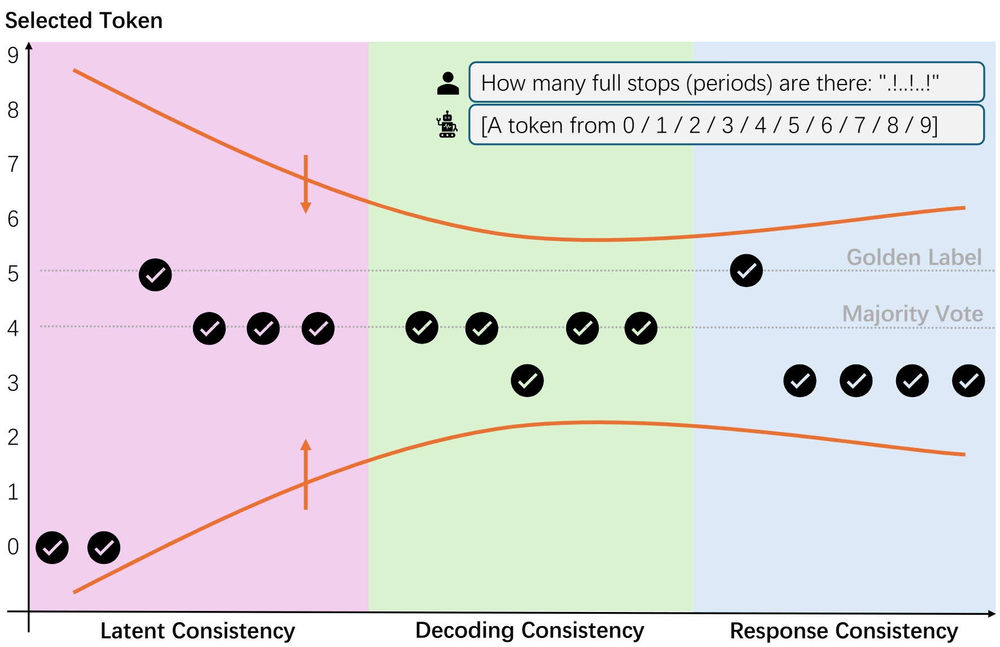

# Experiment Details on Three Types of Consistency

This folder contains the experiment where we asked a model to respond to a straightforward query to observe the consistency in different layers of a model.

In this folder, `README.md` summarizes the experimental results; `expt.ipynb` contains the code to run the experiment; `utils.py` provides a class that modifies the model's attention mechanism, facilitating the experiment.

## Experiment Setup

The given model $\mathcal{M}$ is [Llama3-8B-Instruct](https://ai.meta.com/blog/meta-llama-3/), and the given query $\boldsymbol{x}$ is: "How many full stops (periods) are there: `.!..!..!`". We posed this question to the model to observe the preferred answers in the $\{\text{response}, \text{decoding}, \text{latent}\}$ layers.

## Results

### Results of Latent Consistency

| Setting                                                | Selected Token |
| ------------------------------------------------------ | -------------- |
| Fix $attn^0_0$; Zero out $attn^{i \neq 0}_0$           | 0              |
| Fix $attn^{16}_0$; Zero out $attn^{i \neq 16}_0$       | 0              |
| Fix $attn^0_{15}$; Zero out $attn^{i \neq 0}_{15}$     | 5              |
| Fix $attn^{16}_{15}$; Zero out $attn^{i \neq 16}_{15}$ | 4              |
| Fix $attn^0_{30}$; Zero out $attn^{i \neq 0}_{30}$     | 4              |
| Fix $attn^{16}_{30}$; Zero out $attn^{i \neq 16}_{30}$ | 4              |

> [!NOTE]
> "Fix $attn^{16}_{15}$" refers to keeping the 16th attention head in the 15th layer unchanged, while "zero out $attn^{i \neq 16}_{15}$" means zeroing out all attention heads in the 15th layer except for the 16th one.

### Results of Decoding Consistency

| Decoding Strategy                  | Selected Token |
| ---------------------------------- | -------------- |
| Greedy Decoding                    | 4              |
| Beam Search Decoding ($beam=5$)    | 4              |
| Sampling Decoding                  | 3              |
| Top-k Sampling Decoding ($k=50$)   | 4              |
| Top-p Sampling Decoding ($p=0.95$) | 4              |

### Results of Response Consistency

- Response 1: `There is a period after the first dot, then another period after the second dot, and so on. So, there are 5 periods in total.`
- Response 2: `There is one full stop after the first "!", then another after the second "!", and another after the third "!". So, there are 3 full stops in total.`
- Response 3: `There is one full stop after the first "!", then another after the second "!", and so on. So, there are 3 full stops.`
- Response 4: `There is one period at the end of the first part, then another after the second part, and finally one more after the third part. So, there are 3 periods in total.`
- Response 5: `There is 1 period, then another one, and another one... So, there are 3 full stops!`
