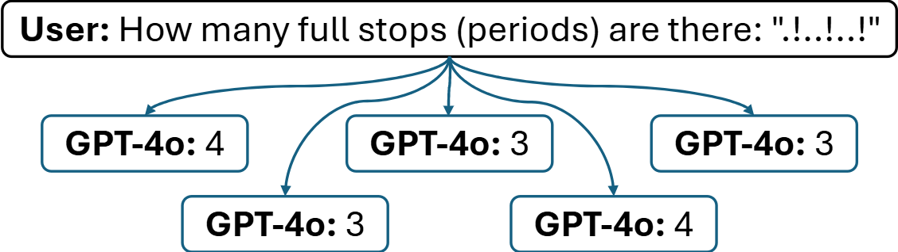

LLMs often generate different answers to the same question, even powerful models like GPT-4o are no exception. For example:



Below are the five corresponding responses obtained from GPT-4o when querying: `How many full stops (periods) are there: ".!..!..!".` The experiment were conducted on June 14, 2024.

Response 1
```md
To determine the number of full stops (periods) in the string ".!..!..!", we need to count the occurrences of the character '.'.
Let's break down the string:
1. ".!": 1 full stop
2. "..!": 2 full stops
3. ".!": 1 full stop
Summing these up:
1 + 2 + 1 = 4
Therefore, there are 4 full stops in the string ".!..!..!".
```

Response 2
```md
The sequence ".!..!..!" contains three instances of "." (full stops or periods). Each segment ".!" has one full stop, and there are three such segments.
```

Response 3
```md
The string ".!..!..!" contains a total of **3** full stops (periods).
```

Response 4
```md
The string ".!..!..!" contains full stops (periods). To determine the number of full stops in this string, we simply count the occurrences of the period character ('.'). Let's analyze the string:
- The first character is a period.
- The second character is an exclamation mark.
- The third character is a period.
- The fourth character is an exclamation mark.
- The fifth character is a period.
- The sixth character is an exclamation mark.
- The seventh character is a period.
- The eighth character is an exclamation mark.
Counting the periods:
1. The first period is at position 1.
2. The second period is at position 3.
3. The third period is at position 5.
4. The fourth period is at position 7.
Therefore, there are 4 full stops (periods) in the string ".!..!..!".
```

Response 5
```md
The sequence ".!..!..!" contains the following characters:
1. Period (.)
2. Exclamation mark (!)
3. Period (.)
4. Exclamation mark (!)
5. Period (.)
6. Exclamation mark (!)
To count the full stops (periods):
1. The first character is a period.
2. The third character is a period.
3. The fifth character is a period.
There are a total of **three** periods in the sequence ".!..!..!".
```
